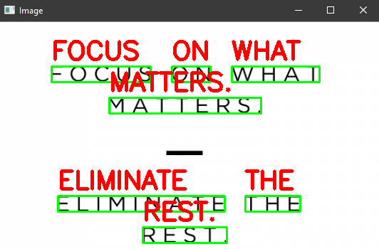

# Tesseract-OCR-Text-localization-and-detection
Implementing text localization, text detection, and OCR with Tesseract

### Sourcerer

### Input (Image)

### Output (Image)

### Requirements

1. OpenCV
2. pytesseract
3. Tesseract OCR

